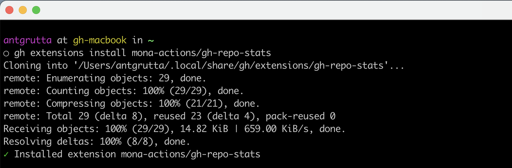
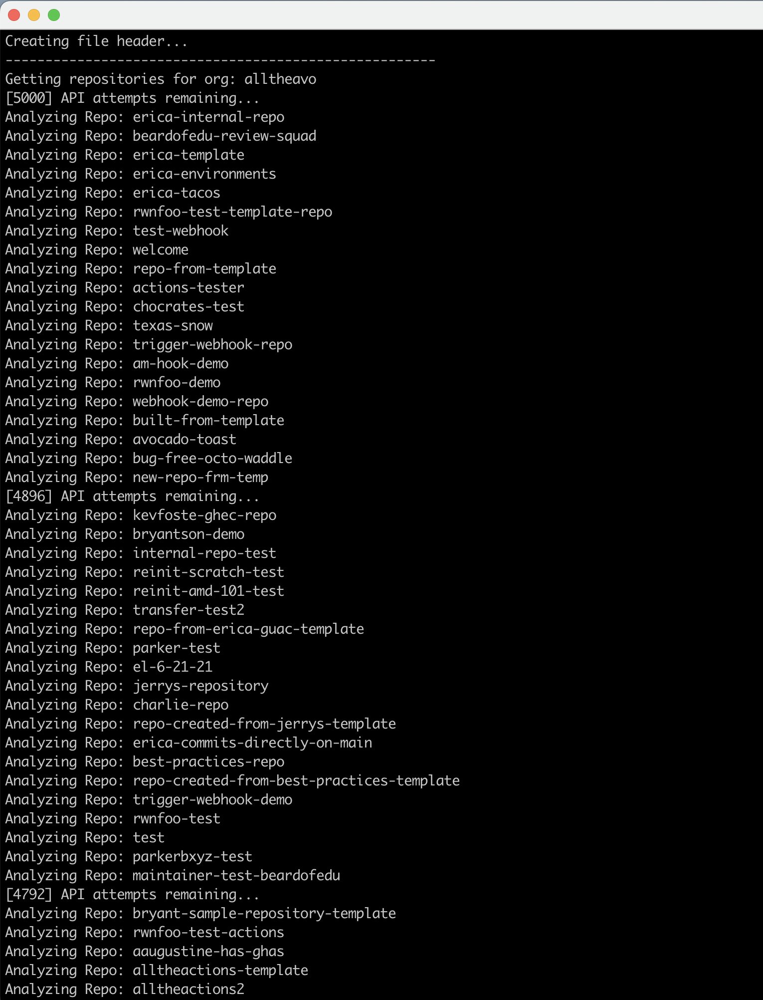
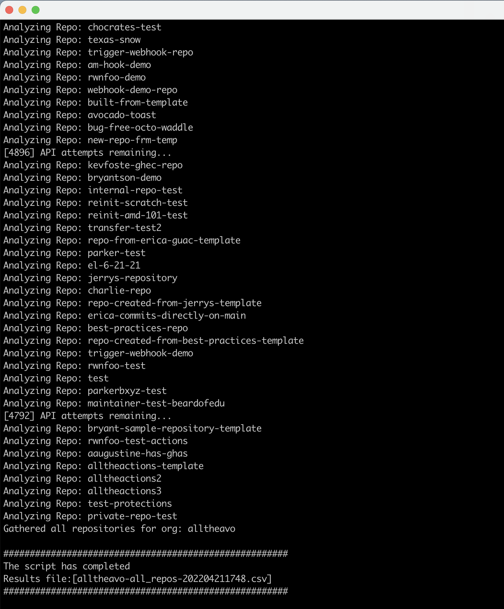

# Get Repository Statistics

**GitHub CLI** extensions are repositories that provide additional `gh` commands, and this **GitHub CLI** extension can help you find information about your repositories in your organizations.
This information outlines the underlying **GitHub** `metadata` associated with your repository. This information is key to understanding how long a migration of the data from one instance of **GitHub** to another will take.
When the extension is run to completion, you will be presented with a visual table, or `*.csv` file to parse for all relevant information.

## GHES Compatibility
The __gh-repo-stats__ extension supports the following versions of GitHub Enterpise Server (GHES):

- Supported: >= 2.20
- Not Supported: <= v2.19

_It should be noted that support for versions < 3.1 is limited._

## Prerequisites

- Operating system that can run shell scripts (*bash/sh*)
- **GitHub CLI** installed by following this documentation: <https://github.com/cli/cli#installation>
- **jq** command-line JSON parser: <https://stedolan.github.io/jq/>

You need to either export these environment variables:

| Environment Variable name | Value                                                                                       |
| ------------------------- | ------------------------------------------------------------------------------------------- |
| GITHUB_TOKEN              | GitHub Personal Access Token (PAT) with `admin:org`, `user:all`, and `repo:all` permissions |
| GHE_URL                   | GitHub URL or GHES URL without HTTP or HTTPS. Defaults to `https://github.com`.             |

Or the script will prompt you to put in the relevant information.

## CLI options

```text
Usage: gh repo-stats [options]

Options:
    -h, --help                    : Show script help
    -d, --debug                   : Enable Debug logging
    -u, --url                     : Set GitHub URL (e.g. https://github.example.com) Looks for GHE_URL environment
                                    variable if omitted or defaults to https://github.com
    -i, --input                   : Set path to a file with a list of organizations to scan, one per line, newline delimited
    -t, --token                   : Set Personal Access Token with repo scope - Looks for GITHUB_TOKEN environment
                                    variable if omitted
    -r, --analyze-repo-conflicts  : Checks the Repo Name against repos in other organizations and generates a list
                                    of potential naming conflicts if those orgs are to be merged during migration
    -T, --analyze-team-conflicts  : Gathers each org's teams and checks against other orgs to generate a list of
                                    potential naming conflicts if those orgs are to be merged during migration
    -p, --repo-page-size          : Set the pagination size for the initial repository GraphQL query - defaults to 20
                                    If a timeout occurs, reduce this value
    -e, --extra-page-size         : Set the pagination size for subsequent, paginated GraphQL queries - defaults to 20
                                    If a timeout occurs, reduce this value
    -o, --org                     : Name of the GitHub Organization to be analyzed           
    -O, --output                  : Determine the output. Can either be "CSV" or "Table" Default: CSV
```
## How to run

Make sure you followed prerequisites and then follow these instructions.

### Step 1: Install GitHub extension

```sh
gh extension install mona-actions/gh-repo-stats
```



### Step 2: Run gh repo-stats

```sh
gh repo-stats --org <ORG_NAME> --ghe-url <GHE_URL> --token <GITHUB_TOKEN>
```

### Example Output




### CSV

Once the script has completed you will have either an inline table, or a genereted `csv` you can use to parse data.

```csv
Org_Name,Repo_Name,Is_Empty,Last_Push,Last_Update,isFork,Repo_Size(mb),Record_Count,Collaborator_Count,Protected_Branch_Count,PR_Review_Count,Milestone_Count,Issue_Count,PR_Count,PR_Review_Comment_Count,Commit_Comment_Count,Issue_Comment_Count,Issue_Event_Count,Release_Count,Project_Count,Full_URL,Migration_Issue
lukaspersonal,monitoring,false,2018-03-12T14:28:22Z,2018-01-26T17:10:44Z,false,0,11,1,0,0,0,4,2,0,0,0,4,0,0,https://github.com/lukaspersonal/monitoring,FALSE
lukaspersonal,pipelines,false,2018-01-26T17:53:32Z,2018-01-26T17:34:50Z,false,0,5,1,0,0,0,4,0,0,0,0,0,0,0,https://github.com/lukaspersonal/pipelines,FALSE
lukaspersonal,hubot,false,2018-03-05T19:00:08Z,2018-01-26T17:55:49Z,false,0,6,1,1,0,0,4,0,0,0,0,0,0,0,https://github.com/lukaspersonal/hubot,FALSE
lukaspersonal,webhooklistener,false,2018-01-26T18:20:03Z,2018-01-26T18:20:04Z,false,0,5,1,0,0,0,4,0,0,0,0,0,0,0,https://github.com/lukaspersonal/webhooklistener,FALSE
lukaspersonal,jenkins,false,2018-03-14T13:20:59Z,2018-03-14T13:21:00Z,false,0,11,1,0,0,0,4,2,0,0,0,4,0,0,https://github.com/lukaspersonal/jenkins,FALSE
```
